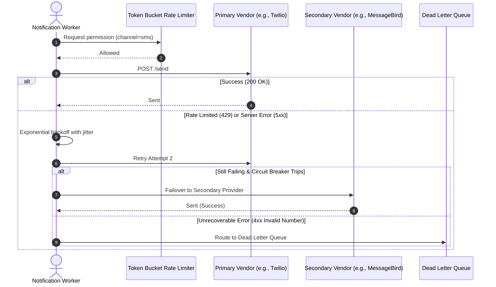

# Part 2: System Design — Notification Service

## 1. Overview & System Goals

This document outlines the architecture for a multi-channel notification platform designed to handle **10+ million notifications per day** (average ~116 req/sec, with peak campaign bursts of 5,000–10,000 req/sec).

### Core Goals & Guarantees
- **Multi-Channel & Extensible:** Supports Email, SMS, and Push notifications with an adapter interface to easily add WhatsApp, Slack, or Webhooks.
- **User Preferences & Quiet Hours:** Honors per-channel opt-outs, user category preferences, and localized quiet hours (e.g. deferring promotional messages between 10 PM and 8 AM in the recipient's timezone).
- **At-Least-Once Delivery & Deduplication:** Zero message loss via persistent message queues and distributed idempotency checks to prevent duplicate sends.
- **Traffic Isolation & Prioritization:** High-priority transactional traffic (password resets, OTPs, security alerts) is isolated from high-volume bulk campaigns (marketing newsletters) to guarantee sub-second delivery for critical alerts.
- **Vendor Resiliency & Rate Limiting:** Circuit breakers, fallback vendor failover (e.g. Twilio → MessageBird; SendGrid → AWS SES), and rate smoothing to avoid upstream vendor throttling.

---

### 1.1. Capacity & Scale Estimates

| Metric | Estimation | Result |
| :--- | :--- | :--- |
| **Daily Notification Volume** | Baseline target | **10,000,000 / day** |
| **Average Ingestion Rate** | 10M / 86,400s | **~116 req/sec** |
| **Peak Campaign Throughput** | Marketing burst peak (50x multiplier) | **5,000 – 10,000 req/sec** |
| **Average Payload Size** | JSON metadata, destination, body | **~2 KB / notification** |
| **Network Bandwidth (Peak)** | 10,000 req/sec * 2 KB | **~20 MB/sec (160 Mbps)** |
| **Storage Growth (PostgreSQL)** | 10M * 500 bytes per row | **~5 GB/day (approx 1.8 TB/year)** |
| **Redis Cache Sizing (24h)** | 10M keys * 128 bytes (idempotency locks) | **~1.28 GB RAM** |

---

## 2. High-Level Architecture Diagram

```mermaid
flowchart TD
    subgraph Client Services
        TS[Auth & Core Services\n(Transactional Events)]
        MS[Marketing & Campaign Engine\n(Bulk Events)]
    end

    subgraph Ingestion Layer
        GW[API Gateway / Load Balancer]
        API[Notification Ingestion Service]
    end

    subgraph Storage & Caching
        Redis[(Redis Cluster\n- Idempotency Keys\n- Preference Cache\n- Rate Limits)]
        DB[(PostgreSQL Primary / Replicas\n- Notification Logs\n- User Preferences\n- Templates)]
    end

    subgraph Message Broker
        TQ[Transactional Queue\n(High Priority / Strict SLA)]
        BQ[Bulk Queue\n(Low Priority / Throttled)]
        DLQ[Dead Letter Queue\n(Failed / Poison Pills)]
    end

    subgraph Processing Layer
        WorkerT[Transactional Workers]
        WorkerB[Bulk Campaign Workers]
        Router[Rule Engine & Preference Resolver]
    end

    subgraph Channel Providers
        EmailP[Email Gateways\nPrimary: SendGrid | Fallback: AWS SES]
        SMSP[SMS Gateways\nPrimary: Twilio | Fallback: MessageBird]
        PushP[Push Gateways\nFCM / Apple APNs]
    end

    subgraph Inbound Webhook Listener
        WH[Webhook Collector Service]
    end

    TS -->|HTTP / gRPC| GW
    MS -->|HTTP / Batch API| GW
    GW --> API
    API -->|1. Check Idempotency| Redis
    API -->|2. Persist Initial State| DB
    API -->|Priority: High| TQ
    API -->|Priority: Low| BQ

    TQ --> WorkerT
    BQ --> WorkerB

    WorkerT & WorkerB --> Router
    Router -->|Check Opt-out & Quiet Hours| Redis
    Router -->|Render Template| DB

    Router -->|Dispatch Email| EmailP
    Router -->|Dispatch SMS| SMSP
    Router -->|Dispatch Push| PushP

    WorkerT & WorkerB -.->|Exhausted Retries| DLQ

    EmailP & SMSP & PushP -->|Delivery Receipts| WH
    WH -->|Update Status: Delivered/Failed| DB
```

---

## 3. Core Components Breakdown

### 3.1. Ingestion API Service
- Exposes `POST /v1/notifications/send` and `POST /v1/notifications/batch`.
- **Validation & Authentication:** Validates input payload and checks tenant permissions.
- **Idempotency Gate:** Checks if the provided `idempotency_key` has already been processed within the deduplication window (24 hours).
- **Initial Persistence:** Creates a record with `status: PENDING` in PostgreSQL and dispatches the event to the appropriate message queue based on priority (`transactional` vs `bulk`).

### 3.2. Message Queuing & Partitioning (Kafka / RabbitMQ)
- Decouples API ingestion from channel processing.
- Uses **two separate queues/topics**:
  1. `notifications.transactional` (High priority, high concurrency, target latency < 1 second).
  2. `notifications.bulk` (Standard priority, rate-smoothed to prevent overwhelming downstream vendors or database connections).
- **Dead Letter Queue (DLQ):** Unrecoverable or permanently failed notifications (e.g. invalid phone number format, exhausted retries) are routed to a DLQ for operational inspection and alerting.

### 3.3. Notification Worker Pool
- Consumes events from the message queues.
- **Preference & Quiet Hour Evaluation:** Checks user settings from Redis cache (falling back to PostgreSQL).
- **Template Rendering Engine:** Merges notification variables with pre-compiled templates (supporting localization).
- **Dispatcher / Provider Adapters:** Dispatches the rendered payload through channel-specific adapters (Email, SMS, Push).

### 3.4. Inbound Webhook Service
- Ingests asynchronous delivery receipts (DLRs), open/click tracking events, and bounce webhooks from third-party vendors (SendGrid, Twilio, FCM).
- Updates delivery logs in PostgreSQL (`DELIVERED`, `BOUNCED`, `FAILED`).
- Automatically flags hard bounces or user unsubscribes in the user preference store.

---

## 4. Key Technical Requirements & Solutions

### 4.1. Multi-Channel Extensibility (Adapter Pattern)
All delivery channels conform to a standardized interface:

```typescript
export interface NotificationPayload {
  notificationId: string;
  recipientId: string;
  destination: string; // email address, phone number, or device push token
  content: {
    subject?: string;
    body: string;
    metadata?: Record<string, unknown>;
  };
}

export interface ChannelProvider {
  channelName: 'email' | 'sms' | 'push';
  providerName: string;
  send(payload: NotificationPayload): Promise<ProviderSendResult>;
  checkHealth(): Promise<boolean>;
}
```

New channels (e.g. WhatsApp or In-App WebSockets) are added by implementing `ChannelProvider` and registering them with the Channel Factory without modifying existing pipeline code.

---

### 4.2. User Preferences, Opt-Outs & Quiet Hours

#### Preference Storage & Caching
- Preferences are stored in PostgreSQL and cached in Redis with a 24-hour TTL (cache invalidated upon user profile updates).

#### Quiet Hours Evaluation Logic
```
Is notification high-priority / transactional (OTP, Security Alert)?
  ├── YES ──> Dispatch immediately (Bypass quiet hours).
  └── NO  ──> Check recipient's local timezone:
               ├── Current local time is within [QuietStart, QuietEnd] (e.g. 22:00 - 08:00):
               │    └── Reschedule job to next available window: QuietEnd + jitter.
               └── Outside quiet hours:
                    └── Proceed to send.
```

---

### 4.3. Deduplication & Idempotency

To prevent sending duplicate notifications if an upstream service retries a request or a worker crashes mid-execution:

1. **Client-Supplied Idempotency Key:** Internal services provide an `idempotency_key` (or a hash of `userId + eventType + payloadHash + hourBucket`).
2. **Redis Atomic Lock:**
   ```text
   SET notification:idemp:{idempotency_key} "PROCESSING" NX EX 86400
   ```
   - If key already exists: Return the existing `notification_id` immediately with HTTP `200 OK`.
3. **Database Unique Constraint:** `UNIQUE (idempotency_key)` on the `notifications` table acts as a reliable secondary barrier.

---

### 4.4. Prioritization: Transactional vs. Bulk Traffic

| Dimension | Transactional Queue (OTP, Password Reset) | Bulk / Marketing Queue (Campaigns, Newsletters) |
| :--- | :--- | :--- |
| **SLA / Latency** | < 2 seconds end-to-end | Minutes to hours acceptable |
| **Worker Allocation** | Dedicated worker pool with fixed minimum instances | Auto-scaling worker pool with rate-throttling |
| **Rate Throttling** | Uncapped (within vendor limits) | Token-bucket throttled (e.g. max 200 SMS/sec) |
| **Queue Policy** | Strict FIFO with high concurrency | Fair-share per campaign |

---

### 4.5. Vendor Rate Limiting, Retries & Fallback Failover



- **Exponential Backoff with Jitter:** Retries follow `wait_time = min(max_wait, 2^attempt * 100ms) + random_jitter(0, 50ms)`.
- **Circuit Breaker:** If primary provider error rate exceeds 15% over a 1-minute rolling window, trip circuit and route traffic to the secondary provider for 5 minutes.

---

### 4.6. REST API Specification

#### `POST /v1/notifications/send`
```json
{
  "idempotency_key": "9b1deb4d-3b7d-4bad-9bdd-2b0d7b3dcb6d",
  "recipient_id": "usr_99812",
  "channel": "sms",
  "priority": "transactional",
  "destination": "+14155552671",
  "template_id": "auth_otp_code",
  "payload": {
    "otp_code": "849201",
    "expires_in_minutes": 5
  }
}
```

**Response (`202 Accepted`):**
```json
{
  "status": "QUEUED",
  "notification_id": "notif_01HXYZ9ABC",
  "idempotency_key": "9b1deb4d-3b7d-4bad-9bdd-2b0d7b3dcb6d",
  "estimated_delivery_ms": 450
}
```

---

## 5. Data Store Choices & Tradeoffs

### 5.1. PostgreSQL (Primary Datastore)
- **Role:** Source of truth for Notification Records, Templates, Delivery Logs, and User Preferences.
- **Rationale:** ACID guarantees, transactional integrity, and indexing on `user_id`, `created_at`, and `status`.
- **Partitioning:** The `notifications` and `notification_delivery_logs` tables are range-partitioned by month (`created_at`) to maintain fast index performance and allow clean archival.

### 5.2. Redis Cluster (Cache & Distributed Coordination)
- **Role:** Idempotency locking, user preference caching, distributed rate limiters, and circuit breaker health counters.
- **Rationale:** Sub-millisecond read/write latency with native atomic commands (`SET NX`, `INCR`, `EXPIRE`).

### 5.3. Apache Kafka / AWS SQS (Message Broker)
- **Role:** High-throughput event streaming and queue buffering.
- **Rationale:** High write throughput, partitioned parallelism, and log retention for replayability if workers need to re-process events.

---

## 6. Database Schema (PostgreSQL DDL)

```sql
CREATE TABLE user_preferences (
    user_id VARCHAR(64) PRIMARY KEY,
    email_enabled BOOLEAN NOT NULL DEFAULT TRUE,
    sms_enabled BOOLEAN NOT NULL DEFAULT TRUE,
    push_enabled BOOLEAN NOT NULL DEFAULT TRUE,
    quiet_hours_enabled BOOLEAN NOT NULL DEFAULT FALSE,
    quiet_hours_start TIME WITHOUT TIME ZONE DEFAULT '22:00:00',
    quiet_hours_end TIME WITHOUT TIME ZONE DEFAULT '08:00:00',
    timezone VARCHAR(50) NOT NULL DEFAULT 'UTC',
    updated_at TIMESTAMP WITH TIME ZONE NOT NULL DEFAULT NOW()
);

CREATE TABLE notifications (
    id UUID PRIMARY KEY DEFAULT gen_random_uuid(),
    idempotency_key VARCHAR(128) UNIQUE NOT NULL,
    user_id VARCHAR(64) NOT NULL,
    channel VARCHAR(16) NOT NULL CHECK (channel IN ('email', 'sms', 'push')),
    priority VARCHAR(16) NOT NULL CHECK (priority IN ('transactional', 'bulk')),
    status VARCHAR(24) NOT NULL DEFAULT 'PENDING' CHECK (status IN ('PENDING', 'SENT', 'DELIVERED', 'FAILED', 'BOUNCED')),
    destination VARCHAR(255) NOT NULL,
    template_id VARCHAR(64),
    payload JSONB NOT NULL DEFAULT '{}'::jsonb,
    retry_count INT NOT NULL DEFAULT 0,
    created_at TIMESTAMP WITH TIME ZONE NOT NULL DEFAULT NOW(),
    updated_at TIMESTAMP WITH TIME ZONE NOT NULL DEFAULT NOW()
) PARTITION BY RANGE (created_at);

CREATE TABLE notification_delivery_logs (
    id UUID PRIMARY KEY DEFAULT gen_random_uuid(),
    notification_id UUID NOT NULL,
    provider_name VARCHAR(64) NOT NULL,
    provider_message_id VARCHAR(128),
    event_type VARCHAR(32) NOT NULL,
    raw_response JSONB,
    created_at TIMESTAMP WITH TIME ZONE NOT NULL DEFAULT NOW()
) PARTITION BY RANGE (created_at);

CREATE INDEX idx_notifications_user_id ON notifications (user_id);
CREATE INDEX idx_notifications_status ON notifications (status);
```

---

## 7. Operational Monitoring & Observability

- **Key Metrics (Prometheus + Grafana):**
  - Queue depth and consumer lag per priority topic.
  - End-to-end delivery latency (p50, p95, p99).
  - Provider failure rate & 429 response rate per channel.
  - DLQ ingress rate (triggers alerts if > 0.1% of total volume).
- **Distributed Tracing (OpenTelemetry):** Every notification carries a `trace_id` propagated through HTTP → Queue → Worker → Provider headers for full lifecycle tracking.

---

## 8. Security & Data Privacy

1. **GDPR Right to Erasure:** Purge jobs can anonymize recipient `destination` (e.g. SHA-256 hash) and clear user preferences while preserving aggregate counts for auditing.
2. **Encryption:** TLS 1.3 in transit; AES-256 encryption at rest for PostgreSQL volumes and Redis clusters.
3. **PII Masking in Logs:** Sensitive variables (e.g. OTP codes, tokens) are filtered and sanitized in application logs.
